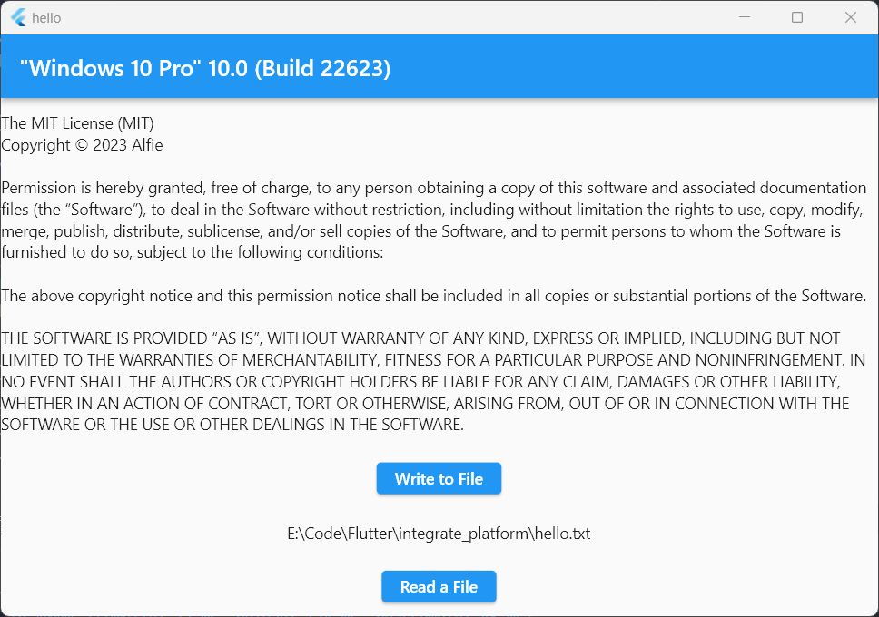

<!--
This README describes the package. If you publish this package to pub.dev,
this README's contents appear on the landing page for your package.

For information about how to write a good package README, see the guide for
[writing package pages](https://dart.dev/guides/libraries/writing-package-pages).

For general information about developing packages, see the Dart guide for
[creating packages](https://dart.dev/guides/libraries/create-library-packages)
and the Flutter guide for
[developing packages and plugins](https://flutter.dev/developing-packages).
-->

Cross-platform [Platform] and File Management.

## Features

- Use `IntegratePlatform` instead of `Platform` to get platform information in io and web.
- Packaged path_provider (In web, you'll get null).
- Packaged File Management. You can read and write a file in io and web.

## Getting started

To use this plugin, add `integrate_platform` as a dependency in your pubspec.yaml file.
```dart
dependencies:
  integrate_platform: ^1.0.0
```

## Usage
 
- Get platform information
```dart
// Get system version
bool operatingSystemVersion = IntegratePlatform.operatingSystemVersion;

// Get platform type
bool isDesktop = IntegratePlatform.isDesktop
```

- Get path in need
```dart
String? path = IntegratePlatform.getCurrentDirectory()
```

- Write and Read file
```dart
// Read file
final result = await IntegratePlatform.readFile();
if (result.success) {
    data = result.content.toString();
}

// Write file
final result =
    await IntegratePlatform.writeFile("hello world", "hello.txt");
path = result.path.toString();
```

The whole examples are in `/example` folder.



## Additional information

Thanks to:
- [path_provider](https://github.com/flutter/plugins/tree/main/packages/path_provider/path_provider)

- [file_picker](https://github.com/miguelpruivo/flutter_file_picker)